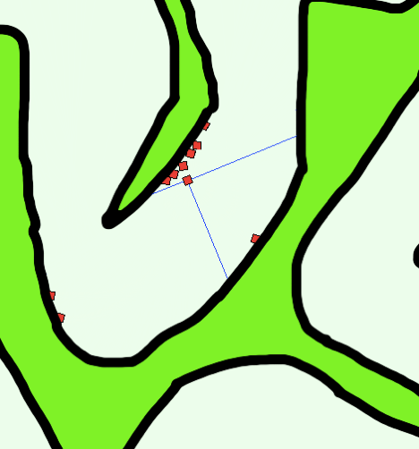

# Racecar

The code here uses a genetic algorithm to evolve a neural net to teach cars to race around a racetrack. A video of what happens can be seen [here](https://www.youtube.com/watch?v=FLv4iKLI8pA). At the end, you can see one square make it entirely around the track. The racetrack itself was coded using PyGame.

## Genetic Algorithms

Genetic algorithms "evolve" over generations to achieve a specific goal. Just like evolution, we pick the most "fit" units to reproduce and have children. During the reproductive process, the children are randomly assigned parnts from all of the parents, with a percentage chance of random mutation as well. The end goal is to have the most "fit" children, where fitness is determined by anything from a mathematical function to user selection. 

These algorithms can solve most problems. The "Evolution.java" program goes through an extremely basic genetic evolution algorithm (the original idea was from a book I read, although I do not remember the name). The goal of the code is to "evolve" a random string into a target string supplied by the user. The program follows the general structure of most genetic algorithms:

1. Start with a randomly initialized unit(s)
    - In this case, we have a random string
2. Choose the most fit children to be the parents of the next generation
    - Hamming distance is used in the case of strings; just counts the number of characters that are wrong
3. Use the selected parents to create the next generation
    - Each new letter has an equal chance of being from either parent, along with a chance of mutation
4. Go back to step 2.

The mutation rate is critical in the evolutionary process: a low mutation rate will lead to a slow approach to a low hamming distance, but a larger mutation rate would make it far harder to converge perfect to the specified string. 

An example of the output can be seen [here](https://pastebin.com/zEqAhtKP).

## Racing

The racing program is in theory exactly the same as the string evolution program above. The only change is that instead of a string, we have cars, and instead of the contents of the string being characters, we have a neural net. Instead of using a string, we are evolving neural networks, specifically the weights and biases. The neural network takes in five inputs, three of which are distsances to walls (specified by the blue lines in the photo below). The other two are the car's current speed and its current orientation. 

The video above gives a demonstration of successfully training one car to go around an entire lap of the racetrack. In this case, the mouse is used to select the most fit car, as there isn't much of a mathematical way to determine which car went the furthest. Any number of parents can be chosen - the probability that they each affect the child for each given weight and bias is the same.

## Struggles

There were two main roadblocks in implementing the neural net for racing. 

###### Tuning the Neural Net

While working with the neural net, I settled with a simple net with two hidden layers, each with four neurons. Initializing the values from a Gaussian distribution seemed best, as biases with extremely large absolute value would be able to skew the result of the sigmoid function for each neuron to almost 1 and -1 each time. 

The mutation rate also had to be tuned to ensure that there was enough variation in each generation to continue to evolve. Without a mutation rate of 0%, it's not too difficul to end up with 600 cars that perform almost exactly the same, with no way to improve upon them at all. Testing showed that a mutation rate of approximately 10% was the best balance between keeping the "DNA" of the parents but still producing variable offspring.

###### Scaling the Features

Another one of the problems was ensuring that the features were scaled properly. Without any scaling, some of the distance inputs could be over 100, which would basically guarantee extremel values to be plugged into the sigmoid function. Using estimates for the mean and standard deviation of the features, subtracting the mean and dividing by the standard deviation gave a good spread of values to be inputted in the neural net for it to learn.
